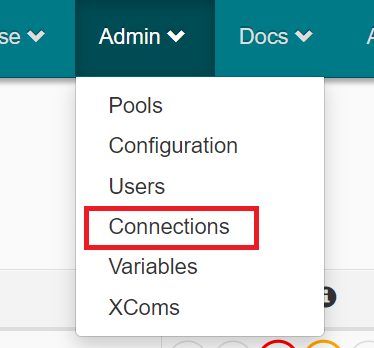
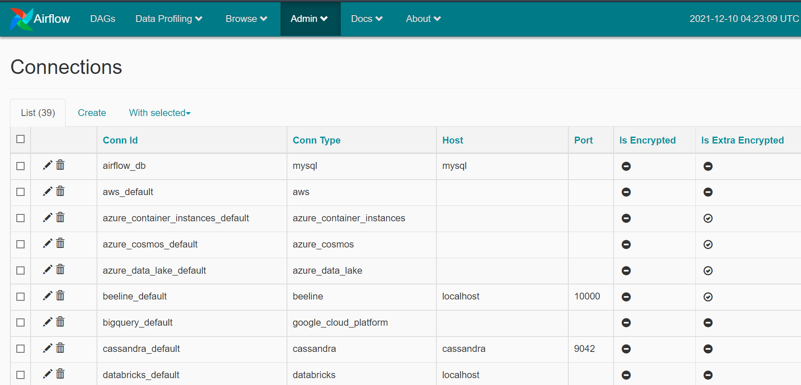
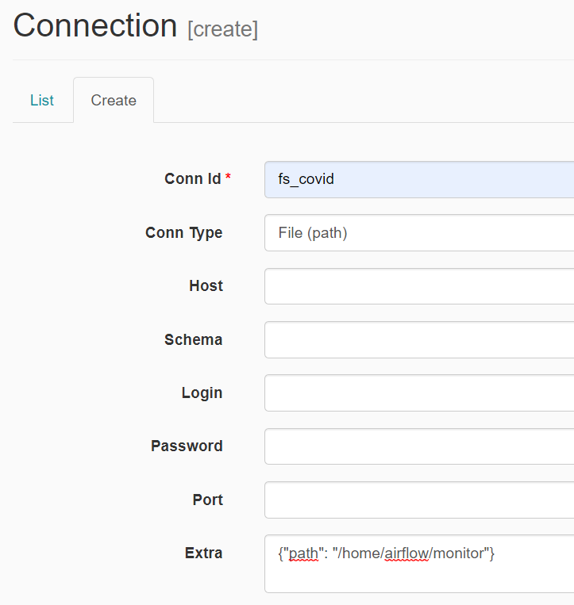
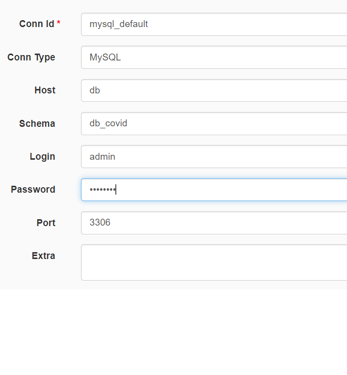
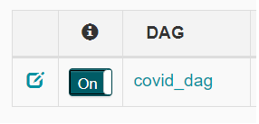
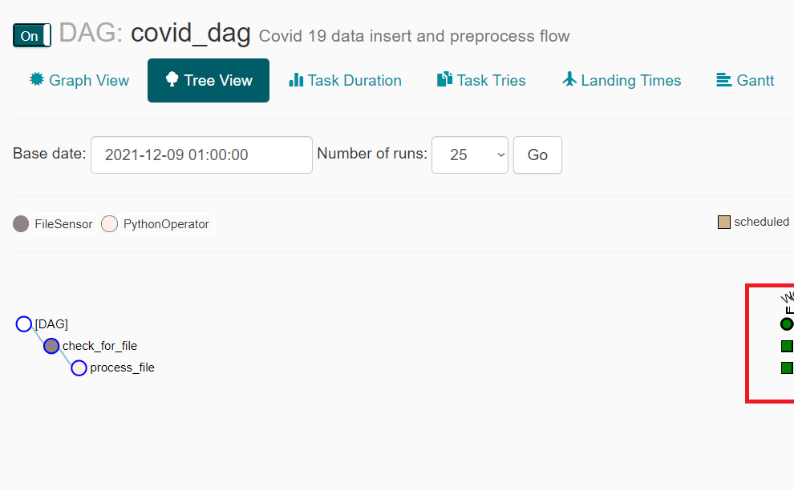

# Proyecto Final - Covid 19 Dashboard

### Integrantes
* Ramón Alberto Escobar Madrid - 21001346
* Heansell Diosymar Tahay Menchú - 20005256
* Edi Antonio Ordoñez Hernández - 9912628
* Tomás Ernesto Esquivel Ramos - 21004407


## App sobre Estadísticas de Covid 19 🚀

<hr/>

## Estructura del proyecto 🖥️

```
root
|
|____api
|    |  crud.py
|    |  database.py
|    |  main.py
|    |  models.py
|    |  schemas.py
|
|____config
|    |  airflow.cfg
|
|____dags
|    |covid_dag.py
|
|____data
|    |  files.csv
|
|____images
|    |  images.png
|
|____project
|    |  app.py
|
|____script
|    |  entrypoint.sh
|    |  schema.sql
|
|____.gitignore
|
|____docker-compose.yml
|
|____Dockerfile
|
|____Dockerfile.fastapi
|
|____Dockerfile.streamlite
|
|____README.md
|
|____requirements.txt
|
|____schema.sql      

```
## Comandos 📋

Para levantar el ambiente de docker, es necesario ejecutar los siguientes comandos:


```
- docker-compose build
- docker-compose up
```

O para bajar el ambiente, lo siguiente:

```
- docker-compose down
```

En caso solo se necesite un servicio, únicamente se le tiene que agregar el nombre después de cada comando mencionado anteriormente, por ejemplo, para la API (fastapi), seria como lo siguiente:

```
- docker-compose build fastapi
- docker-compose up fastapi
- docker-compose down fastapi
```

<hr/>

## Pipeline Dag en Airflow 🛠️

La carpeta llamada "data", dentro de la estructura del proyecto, tendrá contenida los siguientes archivos csv:

- time_series_covid19_confirmed_global.csv
- time_series_covid19_deaths_global.csv
- time_series_covid19_recovered_global.csv

Estos mismos serán cargados a una tabla que se llama `covid_values`, el cual su estructura se encuentra definida en el archivo `schema.sql`. Por lo que vara verificar su contenido se recomienda visualizar en un manejador de base de datos MySQL, con la siguiente configuración:

```
server: localhost
user: admin
pass: admin123
```

La anterior configuración puede modificarse en el archivo docker-compose.yml en el servicio `db`. 

Seguidamente, para acceder desde el ambiente local al servidor de airflow, se recomienda ubicar en el navegador la siguiente ruta:

```
localhost:8080
```

Y para validar que el servidor se haya levantado correctamente, una vez ingresado a la ruta anterior, se deberá mostrar algo como lo siguiente:


Para realizar correr el Dag, es necesario que previo a ese paso, se creen algunas conexiones necesarias, por tanto ubicarse en la pestaña `admin` y `connections`, tal como lo siguiente:



El cual aparecerá la siguiente página:



Para ello ubicarse en la pestaña `create` y escribir la conexión de `fs_covid`, el cual será necesario para que Airflow sepa donde el sensor configurado en el Dag deba leer los archivos a ser cargados en la base de datos:



De la misma forma, en la lista de connections ubicar la conexión `mysql_default` y editarla, o en su defecto crearla con los siguientes parámetros:



De lo anterior se tomaron los siguientes parámetros configurados en el servicio `db` que se encuentra en el archivo de `docker-compose.yml`, el cual el equivalente sería lo siguiente:

```
- Host <=> 'db'
- Schema <=> 'MYSQL_DATABASE'
- Login <=> 'MYSQL_USER'
- Password <=> 'MYSQL_PASSWORD'
- Port <=> 'PORT_DOCKER_SERVICE'
```

## Ejecución del Dag 📦

Posterior a los pasos realizados anteriormente, para activar el dag, es necesario copiar toda la carpeta "data" a la carpeta "monitor" de la estructura del proyecto, tal como lo siguiente:


Seguidamente, ubicarse en el módulo "Dags" del dashboard de Airflow y encender el Dag `covid_dag`, tal como lo siguiente:



Lo anterior debería activar el pipeline de activación de preprocesamiento de la data e inserción, logrando que después de un tiempo se visualice lo siguiente:



## Streamlit Dashboard 📖

### Mapa

El dashboard fue diseñado con Streamlit, por compatibilidad con la funcionalidad y utilizar Python en todo el desarrollo de la aplicación.

Se creo un mapa que muestre por código de colores de burbujas que muestra la totalidad de los casos, recuperaciones y muertes para una fecha dada y un país determinado.


